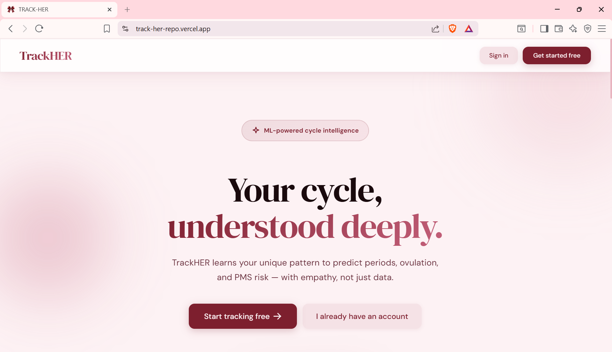
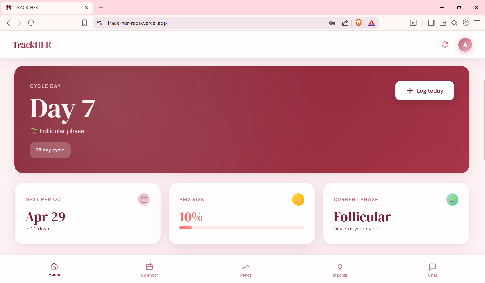
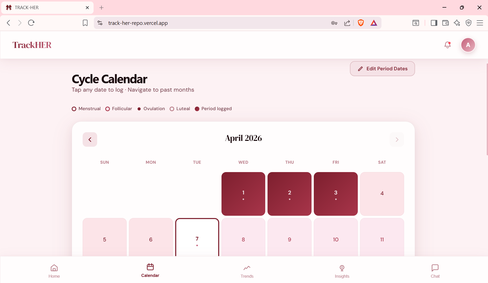

## 🎀 TrackHER — Intelligent Cycle Tracking

Your cycle, understood deeply.

TrackHER is a privacy-first menstrual health web app that helps users track cycles, log symptoms, and receive predictive insights through a rule-based system, with planned machine learning integration.

🔗 Live: https://track-her-repo.vercel.app/

---

## Features

- Cycle tracking with calendar visualization  
- Symptom, mood, sleep, and stress logging  
- Period, ovulation, and PMS predictions  
- Firebase Authentication (Email + Google OAuth)  
- Cycle trend visualization  
- Installable PWA with offline support  

---

## Tech Stack

Frontend: React, TypeScript, Tailwind CSS, Vite  
Backend (BaaS): Firebase (Authentication, Firestore/Database)  
Data Visualization: Recharts  
Machine Learning (in progress): Python, scikit-learn  
Deployment: Vercel  

---

## Preview




.png)
.png)
.png)

---

## Status

UI and core flows completed  
Rule-based predictions working  
ML model in progress  

---

## Local Setup

```bash
git clone https://github.com/priyaharode/track-her-repo.git
cd track-her-repo
npm install
npm run dev
